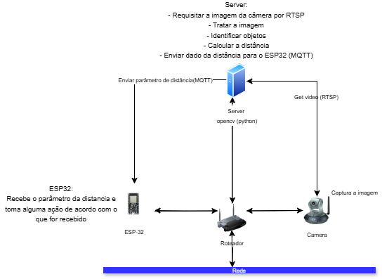
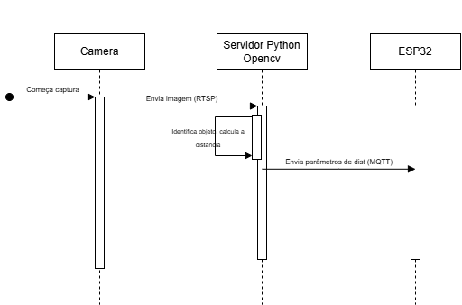

  <h1> Mudança de escopo </h1>
  
Após os testes iniciais, foi identificado que a câmera OV2640 apresentou problemas estruturais que comprometem sua durabilidade e confiabilidade. Assim, optou-se por alterar a arquitetura do projeto, adotando a câmera Speed Dome iCSee, que possui certificações IP67 (resistência à água e poeira) e IK10 (resistência a impactos). Essa câmera foi escolhida por sua robustez e por simplificar a integração com o servidor utilizando o protocolo RTSP.

  <h2>Nova arquitetura</h2>

  
A nova arquitetura integra os seguintes elementos:

1. Câmera Speed Dome iCSee: Captura os frames de vídeo e transmite para o servidor via RTSP.
2. Servidor Opencv: Processa os frames utilizando a biblioteca OpenCV, identifica objetos e calcula a distância.
3. ESP32: Recebe os dados processados do servidor via HTTP e executa ações baseadas nesses parâmetros.
A nova arquitetura está representada no diagrama abaixo:

  
  <h2>Diagrama de tempo</h2>

  
O fluxo de processamento detalhado é descrito abaixo:

<b>Etapa 1:</b> A câmera inicia a captura do vídeo e transmite os frames para o servidor por meio do protocolo RTSP.

<b>Etapa 2:</b> Processamento no Servidor

Recepção dos Dados: O servidor, recebe os frames enviados pela câmera.

Análise e Cálculo: Usando a biblioteca OpenCV, o servidor realiza as seguintes operações:
<ul>
<li>Identificação de objetos relevantes nos frames.</li>
<li>Cálculo da distância entre a câmera e os objetos detectados.</li>
</ul>
<b>Etapa 3:</b> Envio do Parâmetro ao ESP32: 

O servidor transmite o parâmetro de distância calculado para o ESP32 via protocolo HTTP.

Recepção do Parâmetro:
O ESP32 recebe o parâmetro enviado pelo servidor e realiza uma ação com base no que foi recebido.

O ESP32 executa uma ação baseada no parâmetro de distância recebido, por exemplo:
Atuar em um motor (ex: ajustar posição).
Ligar um LED indicador.
Transmitir dados para outro sistema.

 <table>
        <thead>
            <tr>
                <th>Etapa</th>
                <th>Descrição</th>
            </tr>
        </thead>
        <tbody>
            <tr>
                <td>Captura e envio (Câmera)</td>
                <td>Enviar frames via RTSP</td>
            </tr>
            <tr>
                <td>Recepção (Servidor)</td>
                <td>Receber dados RTSP</td>
            </tr>
            <tr>
                <td>Processamento (Servidor)</td>
                <td>Análise e cálculo de distâncias</td>
            </tr>
            <tr>
                <td>Envio ao ESP32</td>
                <td>Transmitir parâmetros</td>
            </tr>
            <tr>
                <td>Recepção (ESP32)</td>
                <td>Receber parâmetro</td>
            </tr>
            <tr>
                <td>Execução (ESP32)</td>
                <td>Ação com base nos dados</td>
            </tr>
        </tbody>
    </table>

Segue a imagem do diagrama de tempo:

  

  <h2>Definição de ambiente e objetos</h2>
  <h3>Ambiente</h3>
  
O ambiente será controlado e minimalista, com o objetivo de reduzir interferências e aprimorar a precisão na identificação dos objetos. Nesse cenário, o único elemento presente é o objeto a ser detectado, posicionado em frente a uma parede branca. O objeto será disposto sobre uma mesa branca, garantindo um contraste visual adequado entre o objeto e o plano de fundo.

  <h3>Objetos</h3>
  
A seleção dos objetos foi realizada com base na biblioteca COCO.names do OpenCV, que contém mais de 80 classes de objetos pré-definidas. Para os testes iniciais em ambiente controlado, foram escolhidos dois objetos principais:

  <ul>
  <li>Mouse</li>
  <li>Teclado</li>
  </ul>
  Essa abordagem permite realizar testes mais precisos e consistentes, com foco nos objetos definidos. Além disso, o método adotado possibilita a futura ampliação do escopo para outros objetos suportados pela biblioteca do OpenCV, mantendo a escalabilidade do projeto.
  <h2>Código para requisitar a imagem da câmera</h2>
  
Acesse o códgio para requisitar a imagem da câmera pelo protocolo RTSP tratar a imagem com Opencv para identificar o objeto no:<a href="codigos/pythonserver"> link </a>

